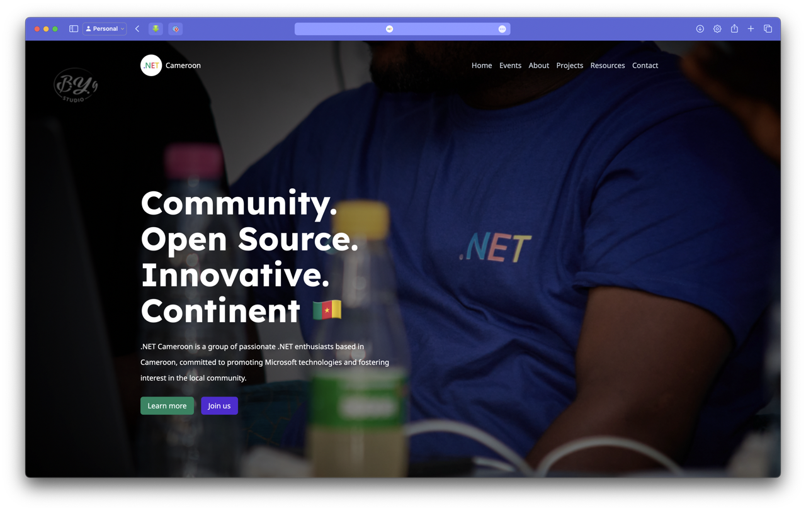

# .NET Cameroon Community Website


Welcome to the official website repository of the .NET Community in Cameroon! This website serves as a hub for our community, providing information about events, resources, and news related to .NET technologies.

[Visit the Website](https://dotnet.cm)



## Table of Contents

- [Introduction](#introduction)
- [Features](#features)
- [Technologies Used](#technologies-used)
- [Getting Started](#getting-started)
- [Contributing](./COUNTRIBUTING.md)
- [License](./LICENSE.txt)
- [Code of Conduct](./CODE_OF_CONDUCT.md)

## Introduction

The .NET Cameroon Community Website is an open source project aimed at fostering collaboration and knowledge sharing among .NET developers in Cameroon. We welcome contributions from everyone, whether you're a seasoned developer or just getting started with .NET.

## Features

- **Event Listings**: Stay updated with the latest events and meetups.
- **Resources**: Access a wealth of learning materials and tutorials.
- **News**: Get the latest news and updates from the .NET world.
- **Community Contributions**: Share your knowledge and projects with the community.

## Technologies Used

- **Web frameworks**: Blazor SSR, HTML, CSS, JavaScript, Tailwindcss
- **Database**: SQLite / SQL Server
- **Hosting**: Azure

## Getting Started

To get a local copy up and running, follow these simple steps.

### Prerequisites

- [.NET 8 SDK](https://dotnet.microsoft.com/en-us/download/dotnet/8.0)
- [Node.js](https://nodejs.org/en/download/package-manager)
- [Git](https://git-scm.com/downloads)
- [Docker Desktop](https://www.docker.com/products/docker-desktop/)
- [dotnet-ef global tool](https://learn.microsoft.com/en-us/ef/core/cli/dotnet)

### Installation

#### 1. Clone the repo

```sh
git clone https://github.com/dotnetcameroon/website.git
```

#### 2. Navigate to the project directory

```sh
cd website
```

#### 3. Install frontend dependencies

```sh
npm install
```

#### 4. Setup the database

At the first launch, you will need to setup and migrate the database inside a docker container.
The `docker-compose.yml` file gives you the definition of how the services are deployed in Docker, and you can run it at any time. For the first launch though, you will need an extra setup to migrate the database and to populate it with fake data.

The required commands are registered in the `/scripts` folder, depending on whether you are on Windows or UNIX based OS.

Execute the `setup` script by running the command:

##### **On UNIX Based OS 🐧**

```sh
./scripts/linux/setup.sh
```

> Note ⚠️:
> This command may not work directly based on the permission restrictions on executable scripts.In that case, run the following command to change the script permissions to allow executions:
> `chmod u+x scripts/linux/setup.sh`

##### **On Windows 🌫️**

```sh
.\scripts\windows\setup.bat
```

> Note ⚠️:
> This may or may not require to open PowerShell in Admin mode

To customize the seeders, take a look at this package repo: [dotnet-ef-seeder](https://github.com/djoufson/dotnet-ef-seeder) (Give a ⭐️)

#### 5. Run the application

```sh
npm start
```

The application is running on <localhost:8000>.

Once you are all set up, you can start the Tailwindcss listening server by running the command

```sh
npm run tailwind
```

## Credits

We were greatly inspired by the following resources

- [.NET Foundation's website](https://dotnetfoundation.org)
- [LARAVEL Cameroon's website](https://laravel.cm)
